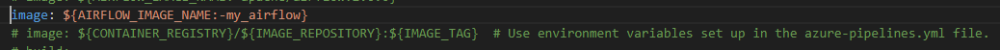

# Intro
This is the Airflow app containerized using Docker. It can be ran on a local computer using Docker or it can be deployed on Azure Linux VM using Azure Pipelines and the azure-pipelines.yml YAML file.

In order to deploy this app we can use the 'create_acr' module from the 'azure_terraform' repository in order to automatically create:
- Azure Container Registry (ACR) - where we will be storing our Docker images.
- Service Principal - with the 'acrpush' role and scope for the created ACR. It will be used for authentication when pulling and pushing images to ACR.

Then we can use the 'azure_devops_rest_api' repository in order to automatically set up resources in Azure DevOps needed for running our CI/CD pipeline:
- Variable group in Library - where we will keep stored securely confidential Service Principal credentials which will be used in the YAML file.
- Service connection - linked to the ACR which will be used in order to push Docker images to the ACR.
- Agent pool - here we will add Agents which will be used to perform actiones defined in the CI/CD pipeline.

This repository can be also used in order to generate a proper YAML file which will need to be added to this repo in order to run CI/CD pipeline. The pipeline created using this YAML file will be performing following actions:
- Build a Docker image using code from repository and push that image to the ACR.
- Pull an image from ACR to the Linux VM where we have installed a Self Hosted Agent and run that image.

Then we need to create a Self Hosted Agent on a Linux VM. For that purpose we can use the 'create_linux_vm' module from the 'azure_terraform' repository. It will use Terraform in order to automatically:
- Create Azure Linux VM.
- Install on that VM a Docker and Azure Pipelines Self Hosted Agent. Agent will be added to a specifiec pool.
- Generate SSH private key which can be used to connect to the created VM.

Once this is done we can set up a CI/CD pipeline in Azure DevOps using generated YAML file and run it order to deploy our app on the created Linux VM.

More information about setting up resources in Azure and Azure DevOps can be found in the relevant repositories.

# Docker compose file
We need to define a proper Docker image in the docker-compose.yaml file depending on if we want to run the Docker conainer locally or deploy it on Azure Linux VM.

If we want to run it locally then we need to specify in the docker-compose.yaml file the following image:

And if we want to deploy in to the Azure Linux VM using the CI/CD pipelines created using the 'azure_devops_rest_api' repository, then we need to replace it with this image:

Both lines are included in the docker-compose.yaml file. We just need leave the proper one and comment the other one.

In the second scenario we are using the environment variables to get the image name. Those variables will be created on the VM running the image before pulling the image during the CI/CD pipeline. It is described more detailed in the 'azure_devops_rest_api' repository.