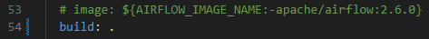
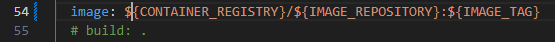

# Intro
This is the Airflow app containerized using Docker. It can be ran on a local computer using Docker or it can be deployed on Azure Linux VM using Azure Pipelines and the azure-pipelines.yml YAML file.

In this repository we are using the Delta Lake framework for storing data as delta tables in Azure Data Lake. We are using the deltalake library ([delta-io.github.io/delta-rs](https://delta-io.github.io/delta-rs/)). Don't confuse it with the delta library ([docs.delta.io/0.4.0/api/python](https://docs.delta.io/0.4.0/api/python/index.html#), [docs.delta.io/latest](https://docs.delta.io/latest/index.html)). Delta library requires to use Spark engine, deltalake doesn't.

# Running the app
In order to start the Ariflow on our local computer we need to run the 'docker compose up' command.

# DAGs
There is one dag (dag/project_1/dag_1.py) which is ingesting data from the MS SQL db into the Azure Data Lake. Data is saved in the Data Lake straight away as a delta table using the deltalake library. We are performing here both full truncate and load, and incremental load. 

In full truncate and load we are truncating the entire target table in Data Lake and loading into it the entire data from the source table in the SQL db.

In the incremental load we are only updating the target table based on changes which happened to the source table. For that we are using a changes table which describes what changes happened to the source table, that is which records have been modified, deleted and inserted. Also we are using extract logs which are saved in the Data Lake and they contain information about when the last time we extracted data for each table.

Before we ran this dag we need to set up the SQL db and the Data Lake using the data_lake_ingestion repository like it is described in the 'App prerequisites' section below.

At the begining of the definition of the task which is executed in that dag we are specifying which tables we will be ingesting and providing additional information needed for incremental load. This dag creates, if it doesn't exist yet, a container with a delta table that contains extract logs.

# App prerequisites
Before we run this app we need to:
- **Create an Azure MS SQL database and Azure Data Lake** - between which we will be transferring data. For that we can use the azure_terraform repository, data_lake and sql_db modules which will create all the Azure resources needed automatically using Terraform.
- **Set up firewall rules in the SQL database** - in order to connect to the created SQL database we need to add our IP address to the firewall rules. We can do that in Azure platform if we go to the MS SQL server resource > security > networking. There we can add the IP address of our currently used computer to the firewall rules.
- **Ingest data into the SQL db** - We need to ingest data into the SQL db which we will be later on ingesting into the Data Lake using Airflow. We can do that using the sql_ingestions_v1.py script from the data_lake_ingestion repository which is using the SQLAlchemy library.
- **Set up container in the Data Lake** - We need to create a container and directory in the Data Lake into which we will be ingesting data. For that we can use the data_lake_setup.py script from the data_lake_ingestion repository which is using Azure SDK.
- **create the .env file** - That file should be located in the dags/project_1 folder together with the dag_1.py script. That file will contain confidential variables which are accessed in the dag_1.py script using the os.getenv() function. They are needed for connecting to the SQL db and Data Lake. Those are:
    - ACCOUNT_NAME - Name of the Storage Account (Data Lake)
    - ACCESS_KEY - Data Lake access key. When we are creating a Data Lake using the data_lake module from the azure_terraform repository, the access key is saved in the Terraform output 'primary_access_key'.
    - SQL_SERVER_NAME - Name of the SQL server from which we will be ingesting data.
    - SQL_DB_NAME - Name of the db in the SQL server from which we will be ingesting data (it can be any database on that server).
    - SQL_USERNAME - username used for logging into the SQL server.
    - SQL_PASSWORD - password used for logging into the SQL server.

# App notes
In the below subsections there are explained important notes helping with understanding this code.

## Python libraries required for Dags
In the requirements.txt we are specifying all the Python libraries which are needed to run our dags. 

It is a good practice to include in that file a version of airflow which we want to use, for example: 'apache-airflow==2.6.0'. That's because other libraries might be in conflict with the airflow version which we want to use and this way we will see logs about that. Otherwise airflow version might be changed automatically. Also it is good to include 'apache-airflow' in requirements.txt file when we are developing code which we will want to run later on using Airflow.

## Python classes
In the common/classes folder we are specifying all the classes which will be used by all the dags. We have the following classes defined:
- **AzureBlob** - This is a class for working with containers, directories and files (creating them, deleting, renaming). This class is a parent to the DeltaLake and ExtractLogs classes.
- **DeltaLake** - This is a class for working with delta tables (creating, writing data, reading data, updating them incrementally). It extends the AzureBlob class.
- **SQL** - This is a class for working with SQL. This class is used in the DataIngestion class.
- **ExtractLog** - This is a class for working with extract logs which are used for incremental load. This class is a parent to the DataIngestion class.
- **DataIngestion** - This is a class for creating data ingestion pipelines. There are functions for full and incremental load.

# Ideas for app improvements
Below are some ideas for the future improvements of this application

## Confidential variables
Instead of storing confidential variables in the .env file in the dags/project_1 folder it would be better to store them somewhere where they can be accessed remotely, for example in Azure Key Vault and access them using Azure Rest API or Azure SDK.

Using .env file will not be practical when we want to deploy our app. We can't place that file in the repository from which code will be deployed using a CI/CD pipeline.

# Docker notes
In the below sections there are explained important aspects of how to use Docker for running this app.

## Dockerfile
In the Dockerfile we are installing tools needed for our dags:
- **Microsoft ODBC driver 18** - Needed for connecting to SQL databases from dags using SQLAlchemy library.
- **Python libraries** - We are installing all the required Python libraries from the requirements.txt file which will be used in dags.

We are installing all those tools by executing bash scripts using the 'RUN' command in the Dockerfile.

## Docker compose
We are using the official Docker compose file as described here: [airflow.apache.org](https://airflow.apache.org/docs/apache-airflow/2.6.0/howto/docker-compose/index.html).

In that Docker compose file we just need to comment out the line about image and uncomment the line about build: \
 \
That's because we want to extend the basic Airflow image using the Dockerfile.

# App deployment
In order to deploy this app we can create a CI/CD pipeline in Azure DevOps which will be performing following actions:
1. Build a Docker image using code from this repository and push it to the Azure Container Registry (ACR).
2. Pull a Docker image from ACR onto an Azure Linux VM and run it.

Before we create such a pipeline we need to create proper resources in Azure and Azure DevOps at first. We can do that automatically using Terraform and DevOps Rest API. Code and more documentation about doing this can be found in the azure_terraform and azure_devops_rest_api repositories respectively. Here are the high level steps we need to do in order to deploy this app:
1. **Prepare the Docker compose file** - We need to modify this file like it is described below in this documentation in the 'Docker compose file' section.
2. **Create Agent pool** - Using the 'azure_devops_rest_api' repository, ci_cd_setup > agent_pool_setup > setup.py script.
3. **Create ACR and Service Principal** - Using the 'azure_terraform' repository, create_acr module.
4. **Create an Azure Linux VM** - Using the 'azure_terraform' repository, create_linux_vm module.
5. **Create Variable group, Service connection and generate a YAML file** - Using the 'azure_devops_rest_api' repository, ci_cd_setup > acr_push_and_pull_setup > setup.py script.
6. **Create a CI/CD pipeline** - We need to move the generated YAML file to the repository with the Airflow app and set up a CI/CD pipeline in DevOps website. When creating a pipeline we need to choose an option to use an existing YAML file from repository.

## Agent pool
Here we will add Agents which will be used to perform actiones defined in the CI/CD pipeline. Agent is a software which we will install on the created Azure Linux VM and it will be performing steps defined in our CI/CD pipeline.

## ACR and Service Principal
ACR is used for storing Docker images. Our CI/CD pipeline will be pushing Docker images here and then pulling them onto the VM. Service Principal will be used for authentication when pulling and pushing images.

## Azure Linux VM
This is a VM which will be running our application as a Docker container and also here we will install an Azure Pipelines Self Hosted Agent which will be performing steps defined in our CI/CD pipeline.

## Variable group
The Variable group which we will create in DevOps Library will be used to store confidential credentials for the Service Principal used for authentication when pulling and pushing Docker images. Those credentials will be then used in the generated YAML file.

## Service connection
The Service connection which we will create in DevOps will be used for pushing Docker images to the ACR. It will be used in the generated YAML file.

## YAML file
We will generate the YAML file which is defining steps which needs to be performed in the CI/CD pipeline. Here is a high level overview of what we are defining in that YAML file:
- What Agent pool will be used.
- What Variable group will be used.
- Service connection ID which will be used for pushing Docker images to the ACR.
- Bash script used for pulling and running a Docker image. More details about that script are provided in the documentation in the azure_devops_rest_api repository.

## Docker compose file
We need to define a proper Docker image in the docker-compose.yaml file depending on if we want to run the Docker conainer locally or deploy it on Azure Linux VM.

If we want to run it locally then we need to comment out the line about image and uncomment the line about build: \
 \

And if we want to deploy in to the Azure Linux VM using the CI/CD pipelines created using the 'azure_devops_rest_api' repository, then we need to comment out the line with 'build' and uncomment the line with this image:

Both lines are included in the docker-compose.yaml file. We just need leave the proper one and comment the other one.

In the second scenario we are using the environment variables to get the image name. Those variables will be created on the VM running the image before pulling the image during the CI/CD pipeline. It is described more detailed in the 'azure_devops_rest_api' repository.